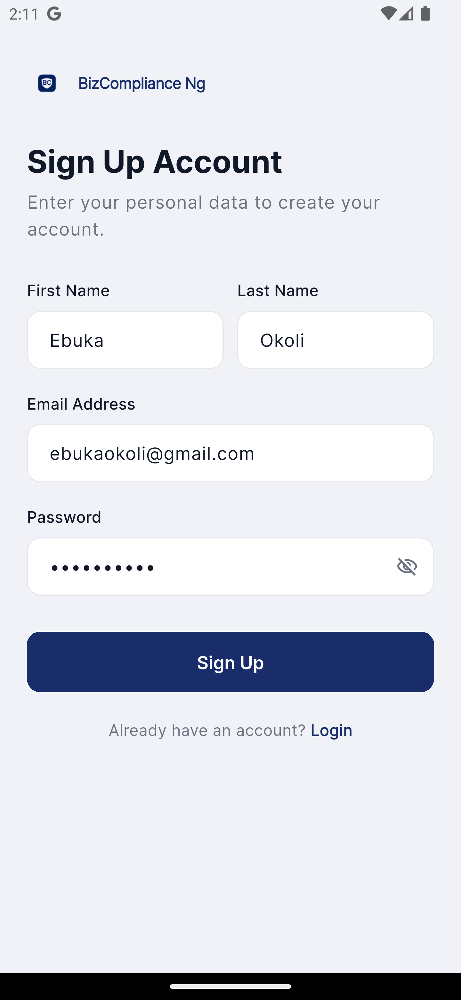
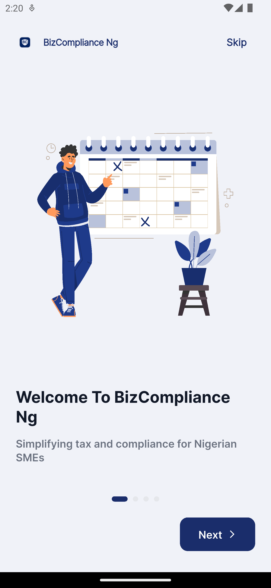
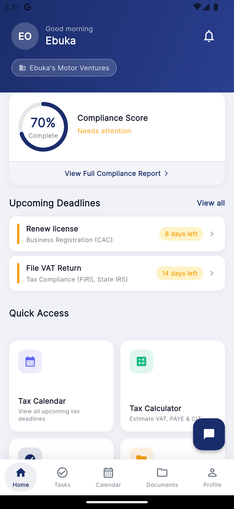

# Development of a Mobile Application for Enhancing Tax Awareness and Business Compliance Among Nigerian SMEs

**Undergraduate Thesis — B.Sc. Software Engineering, Veritas University, Abuja**
Author: Anigbogu Olivia Nneka (VUG/SEN/22/7074) · Supervisor: Dr. Chibueze Valentine Ikpo
May 2026

## Overview

Nigerian SMEs contribute over 54% of national GDP yet remain chronically non-compliant with tax and regulatory obligations. This thesis investigates why — and builds, then evaluates, a working solution.

A needs-assessment survey of 45 Nigerian SME owners identified the core barriers: high professional service costs (44.4%), complicated filing processes (42.2%), poor record keeping (37.8%), low tax awareness (35.6%), and forgotten deadlines (31.1%) — with 51.1% having already incurred financial penalties. Despite 91.1% smartphone ownership and near-universal interest in a mobile solution, no dedicated compliance app existed for this context.

This research designed, built, and evaluated **BizCompliance NG** — a cross-platform mobile application addressing all five barriers directly — as its response.

## Research Questions

1. What are the specific tax compliance challenges, user requirements, and technological constraints faced by Nigerian SMEs?
2. What design principles and interface features constitute an intuitive, accessible mobile tax compliance app for users with varying digital literacy?
3. What functional modules and technical architecture are required to deliver a comprehensive mobile tax compliance solution?
4. To what extent does the developed application improve usability, technical performance, and compliance behaviour?

## Methodology

- **Design Science Research (DSR)** as the overarching framework — appropriate since the primary output is a working artefact (Hevner et al., 2004), applied across five phases: problem identification, solution design, development, evaluation, and communication.
- **User-Centred Design (UCD)**, iterated through requirements gathering, Figma prototyping, development, and testing.
- **Mixed methods**: quantitative data from the 45-owner survey (demographics, compliance challenges, technology readiness, feature preferences), plus qualitative document analysis of FIRS regulations, academic literature, and existing compliance apps.
- **Agile development** across two sprints.
- **Evaluation** across three dimensions: functionality (feature-by-feature testing against requirements), performance (API response time, offline sync accuracy), and expert review (structured walkthrough with supervisor and peer reviewers).

## System

BizCompliance NG is built on Flutter, NestJS, PostgreSQL, and Prisma ORM, and implements eight functional modules:

1. User authentication
2. Six-step business onboarding with automated compliance task generation
3. Real-time compliance score dashboard
4. Task management with step-by-step guidance
5. Digital document management
6. **Ajuri** — a rule-based compliance assistant
7. Tax calculator (VAT, PAYE, Company Income Tax, Education Tax)
8. Push notification deadline reminders

A web-based Admin Panel allows regulatory content updates without developer intervention.

## Results

- 23 functional test cases, 100% pass rate
- API response times averaging under 800ms
- No critical issues identified in expert review

## Contributions

- **Theoretical** — a design framework for translating complex Nigerian tax regulations into plain-language mobile interfaces, extending the Technology Acceptance Model to include infrastructure readiness as an adoption factor.
- **Methodological** — a replicable multi-layered evaluation framework (functional + performance + database integrity) applicable to compliance/service-delivery apps in other developing-economy contexts.
- **Empirical** — primary survey data (91.1% smartphone ownership, 51.1% penalty incidence, 97.8% interest in a mobile solution) as a baseline dataset for future researchers and policymakers.
- **Practical** — a fully working prototype plus a documented technical blueprint adaptable by developers and regulatory bodies.

## Limitations

- Purposive sample of 45 SME owners limits generalisability
- No formal standardised usability testing (e.g. System Usability Scale) — evaluation relied on functional testing and expert review
- No direct integration with FIRS/CAC systems; filings cannot yet be submitted through the app
- Ajuri's rule-based design limits handling of highly nuanced compliance queries

## Repository Contents

- `/thesis` — full thesis document (PDF)
- `/data` — de-identified needs-assessment survey data (n = 45 SME owners), with timestamps and email addresses removed
- `/screenshots` — application screenshots (admin panel, mobile app, Postman API logs, Prisma schema)

## Application

The mobile application (Flutter) and backend (NestJS) source code is maintained in a **private repository**, in line with final-year-project submission requirements.

Demo materials:
- [Admin Panel Demo](https://drive.google.com/file/d/1xQt3BjKtpYZtdDAY3rQ-oRQ8t0BQZnPG/view?usp=sharing)
- [Mobile App Demo](https://drive.google.com/file/d/1hAH9DQQTtC-0wcHwc-nWMmENRFYNy00u/view?usp=drive_link)

## Application Screenshots

*Screenshots below are drawn from `/screenshots/app`. <!-- TODO: replace filenames with the actual images once confirmed --> *

| Registration | Onboarding | Dashboard |
|---|---|---|
|  |  |  |

## Related Work

- [BizComplianceNG](#application) — the application this thesis documents
- *Human-Centred Design for Mobile Platforms Supporting Nigerian SMEs* — related conference paper, Veritas University SDGs International Conference 2026, under review for SCOPUS indexing

## Contact

oliviaanigbogu860@gmail.com
